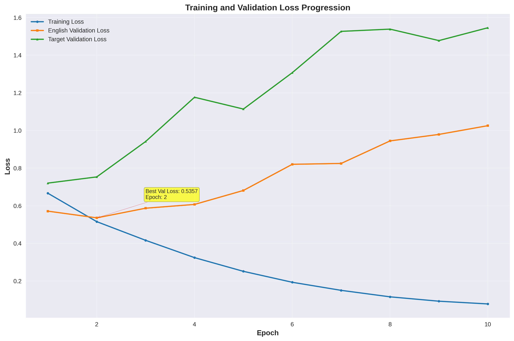
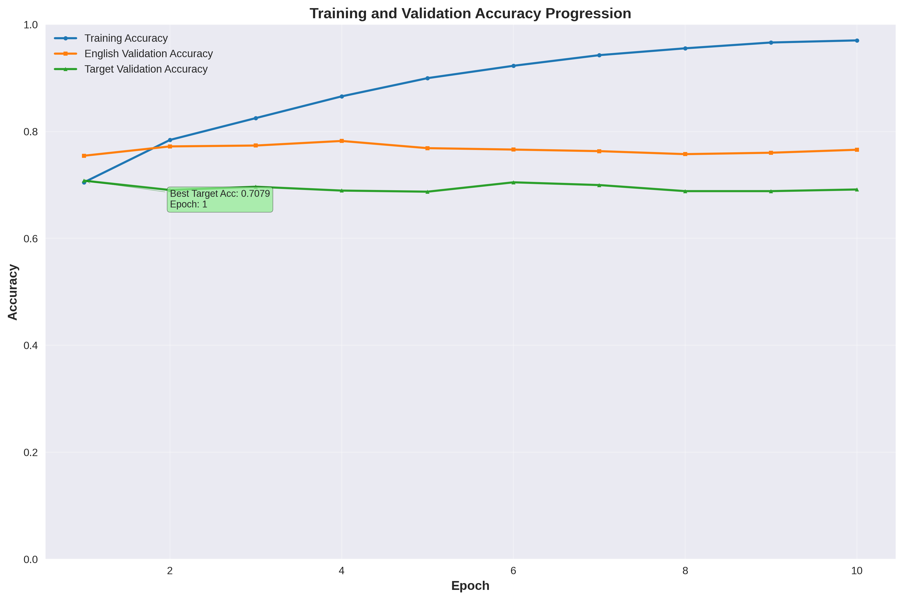
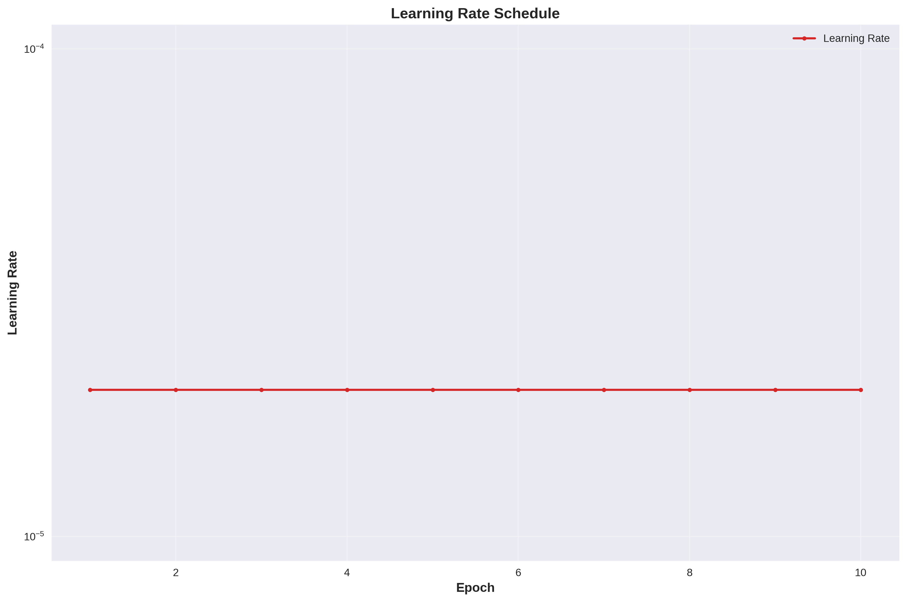
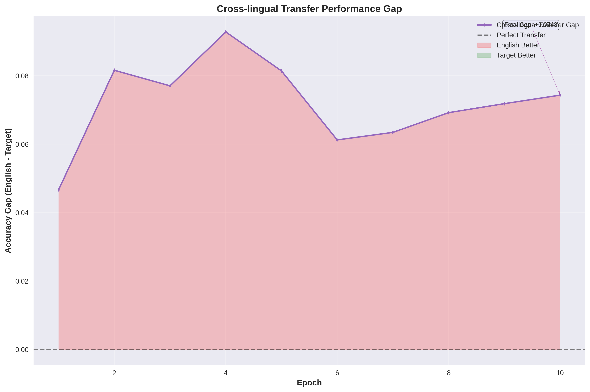
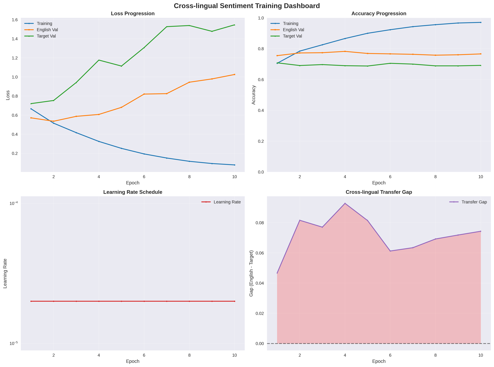
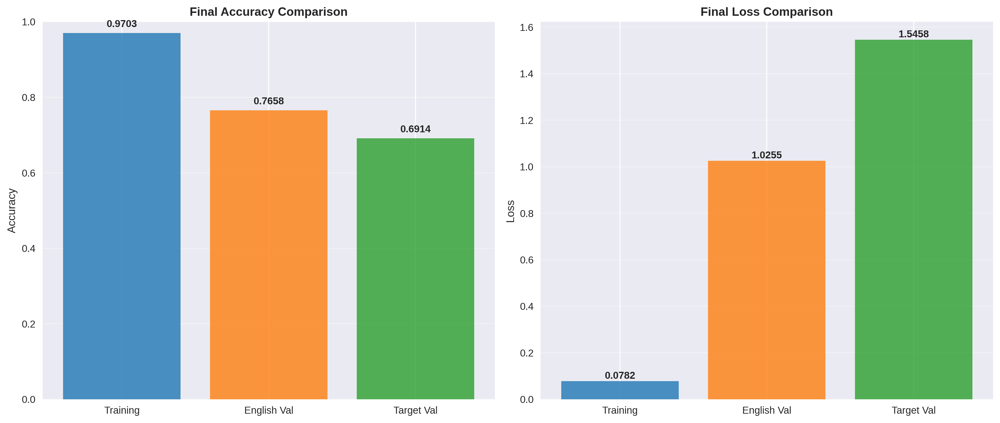

# mBERT Cross-Lingual Sentiment Analysis Results

## Model Specifications

### Architecture
- **Base Model**: BERT-base-multilingual-uncased
- **Model Type**: Fine-tuned sentiment classifier
- **Frozen Layers**: Embedding layer only (allows fine-tuning of transformer layers)

## Training Configuration

| Parameter | Value |
|-----------|-------|
| **Learning Rate** | 2e-5 |
| **Epochs** | 3 |
| **Batch Size** | 48 |
| **Optimizer** | AdamW |
| **Data Percentage** | 1% of full dataset |
| **Device** | CUDA (GPU) |

## Visualizations

### Training Dynamics

*Shows the progression of training loss vs validation losses across epochs*

*Tracks accuracy improvements for training, English validation, and target validation*

*Displays the learning rate progression during training*

### Cross-lingual Analysis

*Visualizes the performance gap between English and target language*

### Summary Dashboards

*Comprehensive view of all training metrics*

*Side-by-side comparison of final model performance across languages*
