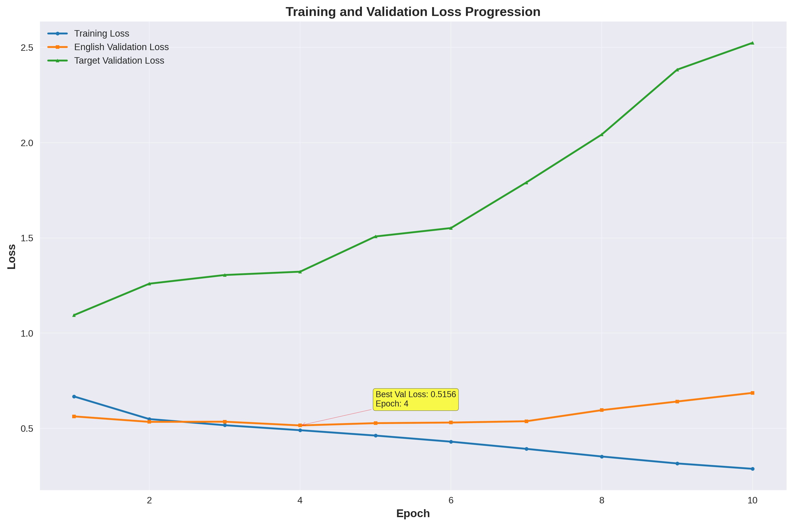
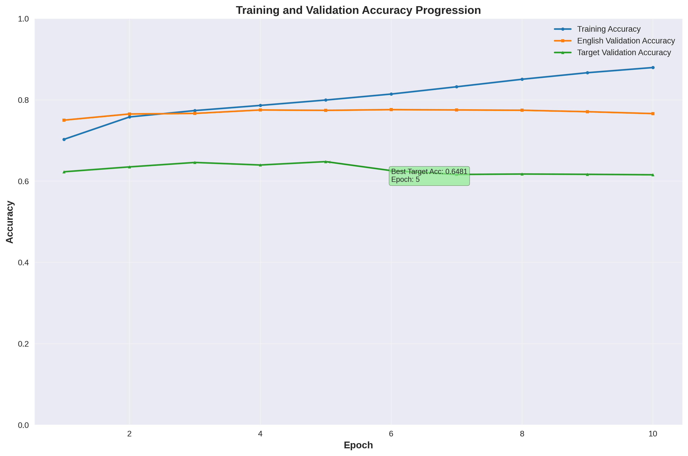
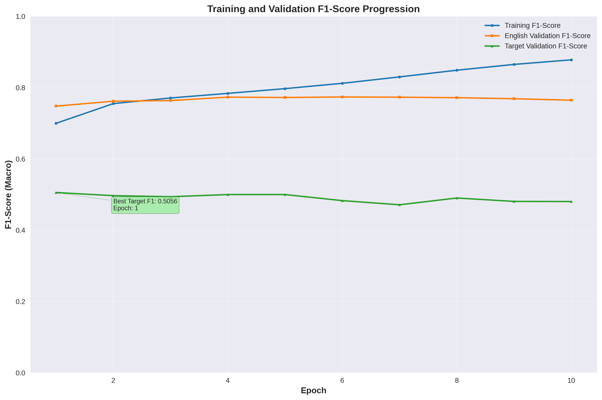
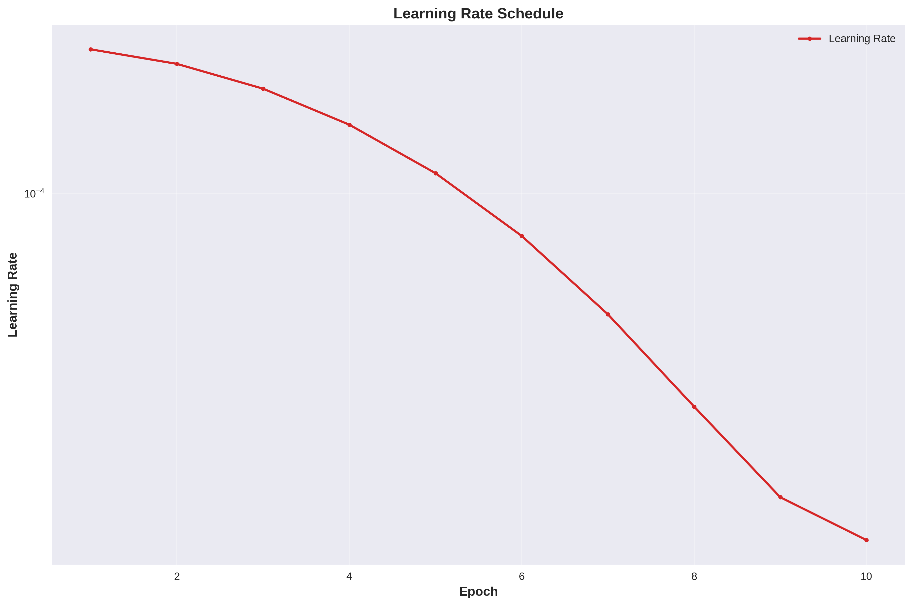
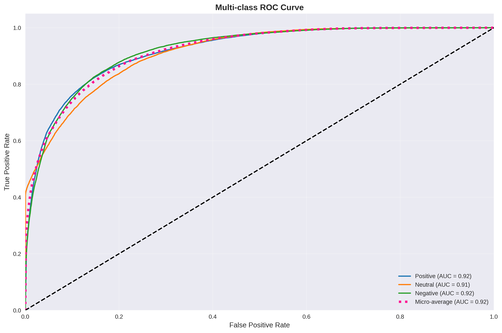
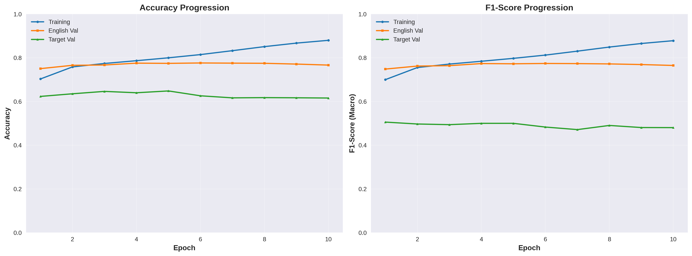
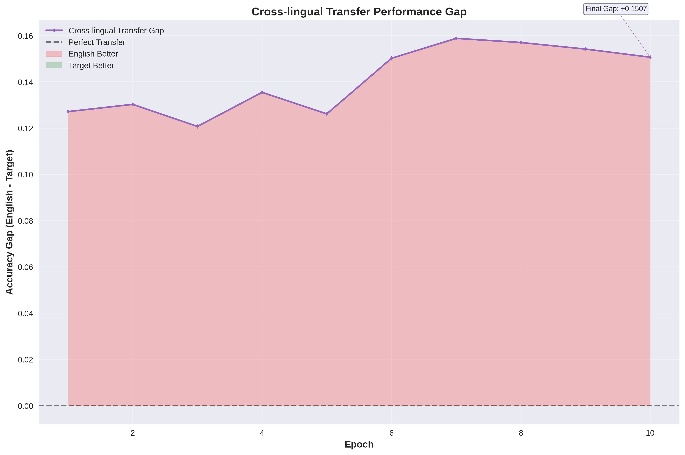
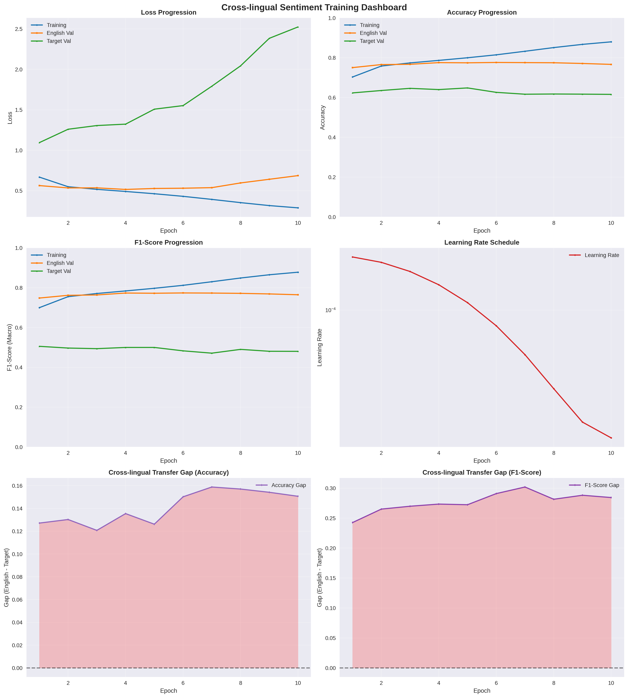
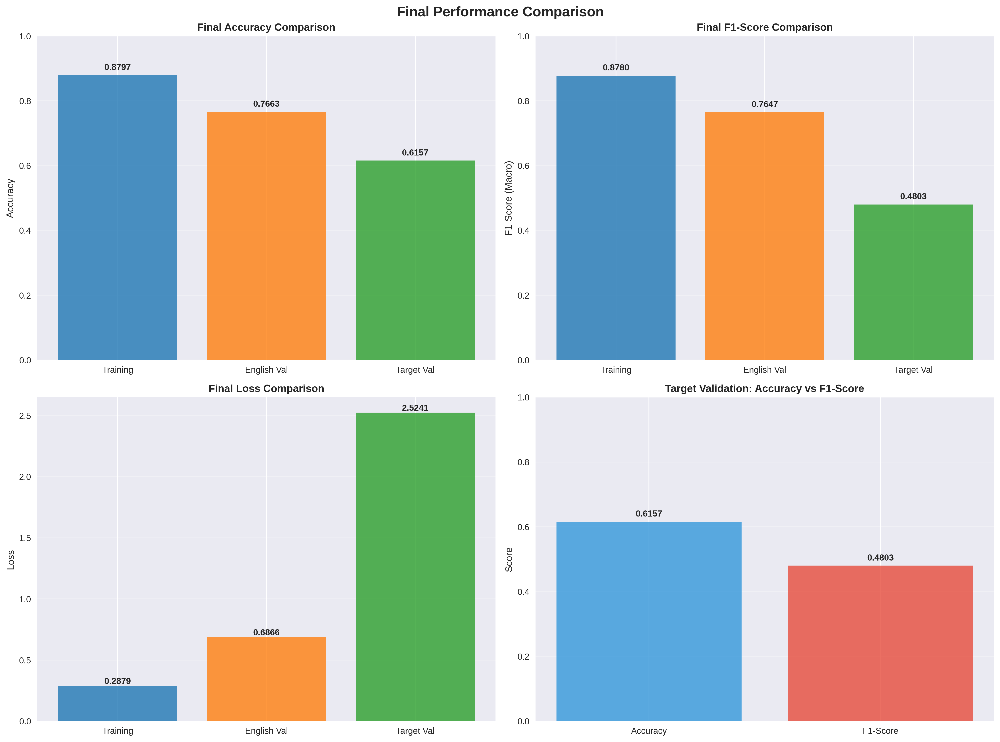

# XLM-RoBERTa Cross-Lingual Sentiment Analysis Results - 6 Layers Configuration

## Model Specifications

### Architecture
- **Base Model**: XLM-RoBERTa-base (modified)
- **Model Type**: Fine-tuned sentiment classifier with reduced layers
- **Encoder Layers**: Only first 6 layers (reduced from 12)
- **Frozen Layers**: Embedding layer only (all 6 encoder layers trainable)

## Training Configuration

| Parameter | Value |
|-----------|-------|
| **Learning Rate** | 2e-4 → 2e-5 |
| **Epochs** | 10 |
| **Batch Size** | 512 |
| **Max Length** | 128 |
| **Optimizer** | AdamW |
| **Scheduler** | CosineAnnealingLR (eta_min=2e-5) |
| **Device** | CUDA (GPU) |

## Model Architecture Details
This experiment explores the effectiveness of using a reduced XLM-RoBERTa architecture:
- **Reduced Complexity**: Uses only 6 out of 12 encoder layers
- **Minimal Freezing**: Only freezes the embedding layer
- **Trainable Components**: All 6 encoder layers and classification head are trainable
- **Cross-lingual Foundation**: Built on XLM-RoBERTa's multilingual pre-training

## Visualizations

### Training Dynamics

*Shows the progression of training loss vs validation losses across epochs*

*Tracks accuracy improvements for training, English validation, and target validation*

*Displays F1-score performance across different languages and datasets*

*Displays the cosine annealing learning rate progression during training*

### Model Performance Analysis

*ROC curve analysis showing model performance across different thresholds*

*Side-by-side comparison of accuracy and F1-score metrics*

### Cross-lingual Analysis

*Visualizes the performance gap between English and target language*

### Summary Dashboards

*Comprehensive view of all training metrics and performance indicators*

*Side-by-side comparison of final model performance across languages*