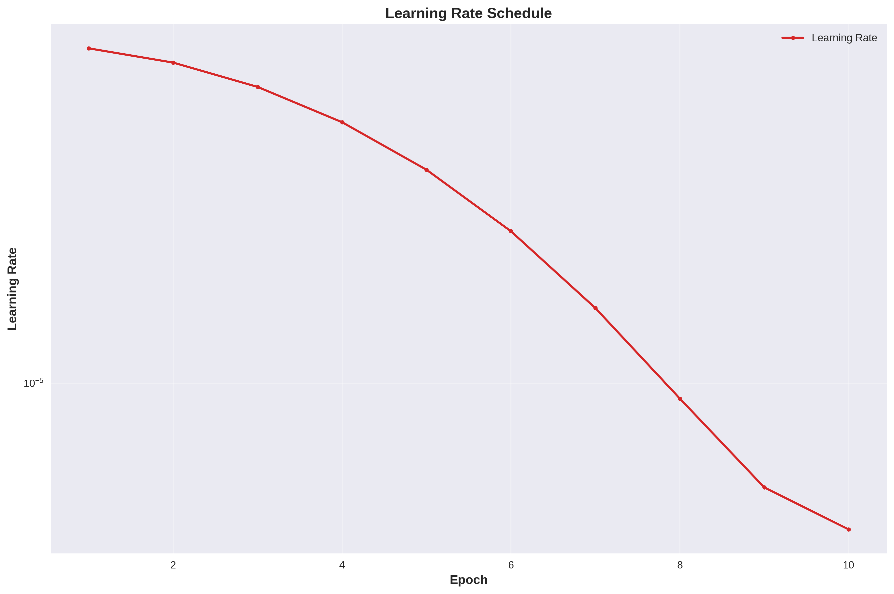

# mBERT Cross-Lingual Sentiment Analysis Results - 6 Layers Configuration

## Model Specifications

### Architecture
- **Base Model**: BERT-base-multilingual-uncased (modified)
- **Model Type**: Fine-tuned sentiment classifier with reduced layers
- **Encoder Layers**: Only first 6 layers (reduced from 12)
- **Frozen Layers**: Embedding layer + first 4 encoder layers (only 2 trainable encoder layers)

## Training Configuration

| Parameter | Value |
|-----------|-------|
| **Learning Rate** | 5e-5 -> 5e-6|
| **Epochs** | 10 |
| **Batch Size** | 1024 |
| **Max Length** | 128 |
| **Optimizer** | AdamW |
| **Scheduler** | CosineAnnealingLR (eta_min=5e-6) |
| **Data Percentage** | 50% of full dataset |
| **Device** | CUDA (GPU) |

## Model Architecture Details
This experiment explores the effectiveness of using a reduced BERT architecture:
- **Reduced Complexity**: Uses only 6 out of 12 encoder layers
- **Selective Freezing**: Freezes embeddings and first 4 encoder layers
- **Trainable Components**: Only the last 2 encoder layers and classification head

## Visualizations

### Training Dynamics

*Shows the progression of training loss vs validation losses across epochs*

*Tracks accuracy improvements for training, English validation, and target validation*

*Displays the cosine annealing learning rate progression during training*

### Model Performance Analysis

*ROC curve analysis showing model performance across different thresholds*

### Cross-lingual Analysis

*Visualizes the performance gap between English and target language*

### Summary Dashboards

*Comprehensive view of all training metrics*

*Side-by-side comparison of final model performance across languages*

## Experimental Goals
This configuration tests whether:
1. A reduced 6-layer architecture can maintain competitive performance
2. Selective layer freezing improves training efficiency
3. Longer training (10 epochs) compensates for reduced model capacity
4. Higher learning rates work better with fewer trainable parameters 